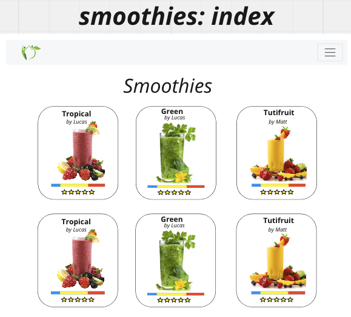
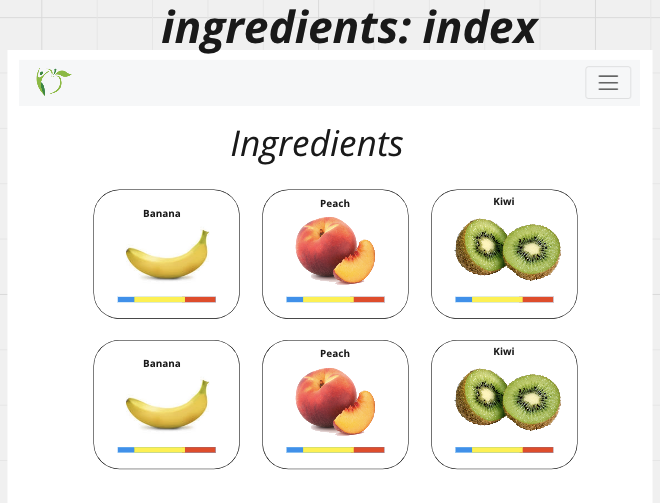
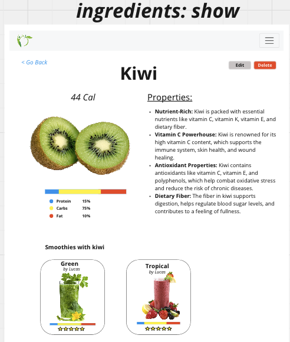
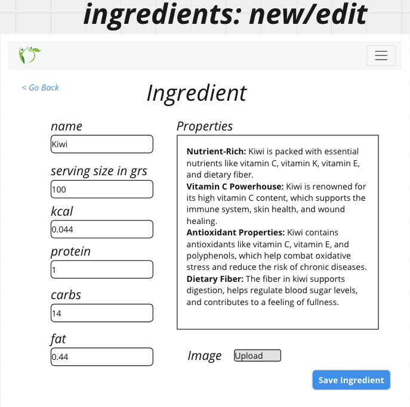
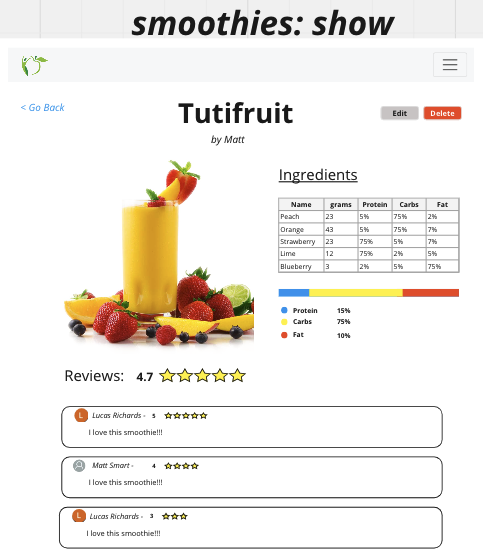
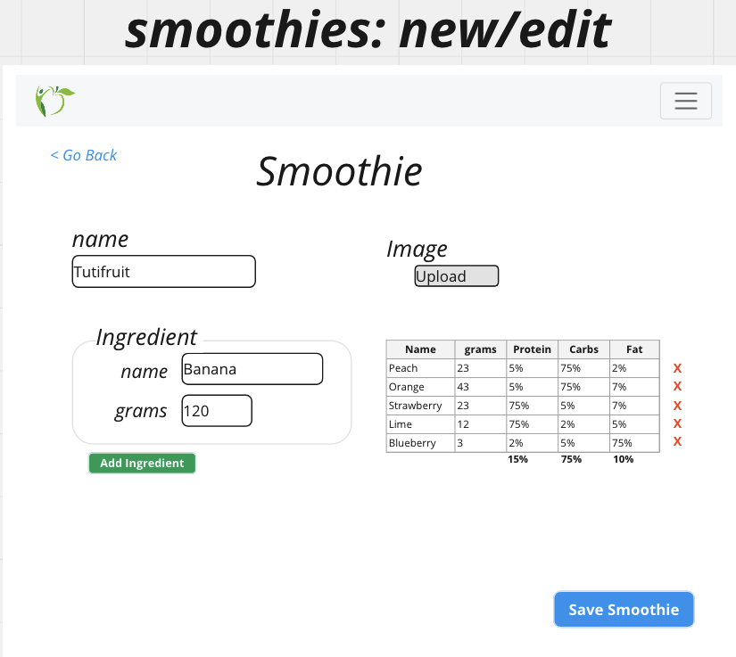
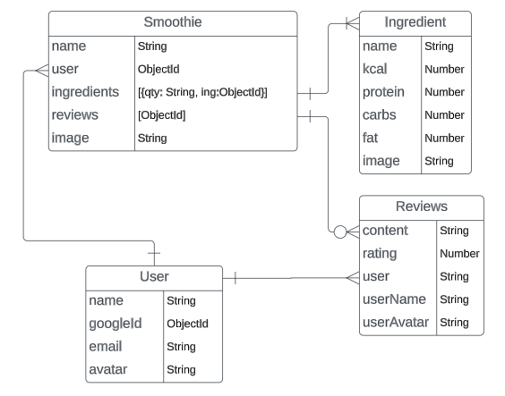

## Smoothies App

## Overview
Smoothies App allows you to create your own smoothie and share it with the world. 



## User Stories
a detailed list of the functionality of your application, told through a user's perspective
  - As a user, I want the ability to sign up using OAuth.
  - As a user, I want the ability to sign in. 
  - As a user, I want the ability to sign out. 
  - As a user, I want the ability to create my own smoothies. 
  - As a user, I want the ability to update my smoothies. 
  - As a user, I want the ability to view all of my smoothies in a list. 
  - As a user, I want the ability to read more details of individual smoothies. 
  - As a user, I want the ability to delete my smoothies. 
  - As a user, I want the ability to view smoothies others have created. 
  - As a user, I want the ability to favorite smoothies that other people have created. 
  - As a user, I want the ability to read all of the smoothies I have favorited. 
  - As a user, I want the ability to remove smoothies from my favorites. 
  - As a user, I want the ability to view all ingredients in a list. 
  - As a user, I want the ability to create my own smoothies's reviews. 
  - As a user, I want the ability to view all reviews for a smoothie. 
  - As a user, I want the ability to update my reviews. 
  - As a user, I want the ability to delete my reviews. 

# Technologies Used

- JavaScript
- EJS
- CSS
- Mongoose
- Express
- OAuth Google
- API (Ingredients DataBase)

# Getting Started

Before running ```nodemon``` to run the server, configure the app:

clone repository and run npm i to install all dependecies.

Add the following env variables:

DATABASE_URL=

GOOGLE_CLIENT_ID=
GOOGLE_SECRET=
If running locally
GOOGLE_CALLBACK=http://localhost:3000/oauth2callback

SECRET=

[Take me to the Smoothie App](https://smoothieapp.fly.dev)

## Routing

#### Smoothies

|HTTP<br>Method|URL<br>Endpoint|Controller<br>Action|Purpose|
|---|---|---|---|
| GET | /smoothies | smoothiesCtrl.index | View all the smoothies regardless of who submitted (use querystring params to perform filtering) |
| GET | /smoothies/mysmoothies | fruitsCtrl.mysmoothies | View all the smoothies submitted by the logged in user |
| GET | /smoothies/:id | smoothiesCtrl.show | View the details of any smoothie |
| GET | /smoothies/new | smoothiesCtrl.new | View a form for submitting a smoothie (be sure to define this route before the show route)|
| POST | /smoothies | smoothiesCtrl.create | Handle the new book form being submitted |
| GET | /smoothies/:id/edit | smoothiesCtrl.edit | View a form for editing a smoothie (restrict to user who submitted the book) |
| PUT | /smoothies/:id| smoothiesCtrl.update | Handle the edit smoothie form being submitted (restrict to user who submitted the book) |
| DELETE | /smoothies/:id| smoothiesCtrl.delete | Delete a smoothie (restrict to user who submitted the book) |
<!-- | POST | /smoothies/:id | smoothiesCtrl.addReading | Add the logged in user's _id to a book's userReading array | -->

#### Reviews

|HTTP<br>Method|URL<br>Endpoint|Controller<br>Action|Purpose|
|---|---|---|---|
| n/a | n/a | index action | View all the reviews for a smoothie - no route needed since reviews are embedded and displayed with their smoothie |
| n/a | n/a | show action | Viewing a single review does not make sense |
| n/a | n/a | new action | The form to add a new review should be displayed on the smoothie's show view |
| POST | /smoothies/:id/review | reviewsCtrl.create | Handle the new review form being submitted |
| GET | /reviews/:id/edit | reviewsCtrl.edit | View a form for editing a review (restrict to user who submitted the review) |
| PUT | /reviews/:id| reviewsCtrl.update | Handle the edit review form being submitted (restrict to user who submitted the review) |
| DELETE | /reviews/:id| reviewsCtrl.delete | Delete a review (restrict to user who submitted the review) |


## Wireframes / Screenshots

### Ingredients Wireframes




### Smoothies Wireframes





## Entity Relationship Diagrams
diagrams that describe the relationships between your resources


# Next Steps

- Future enhancement one: button to upload image
- Future enhancement two: do not redirect if you log in.